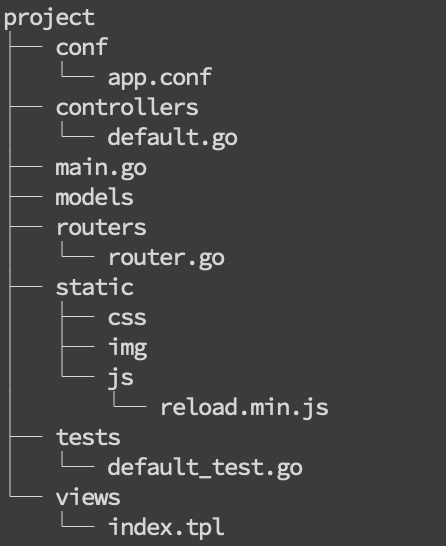
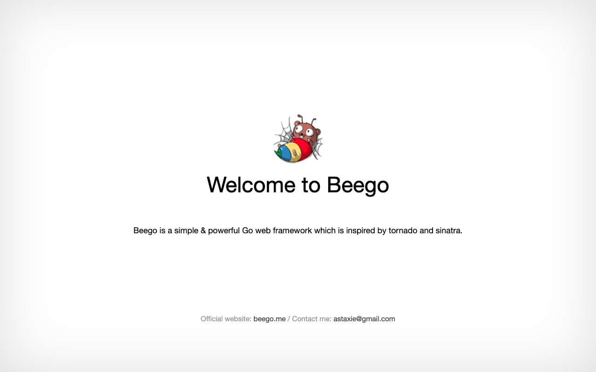

<!--_paginate: false-->
<!--_class: false-->

# Introduction to Beego
## A Famous Web Framework Written In GO

ZoeLiao

---
<!--_class: false-->
# **Contents**
- **What is Beego**
- **Features**
- **How to use it**

---
<!--_paginate: false-->
<!--_class: false-->
<!--
_backgroundColor: #0288d1
_color: white
-->
# Ch1. What is Beego

---
## **What is Beego**
- Born in 2012
- Beego offers:
  - automated testing and code hot compiling,
  - native HTTP package for high performance
- Beego supports smarty
- Go 1.1+

---
## **Beego tool -- bee**
- The new command is used for crafting new web applications. The api command is used to create new API applications.
- Command:
  ```go
  go mod init
  go get github.com/astaxie/beego
  GO111MODULE=off go get -u github.com/beego/bee
  mkdir src
  cd src
  bee new project
  cd project
  go init project
  bee run
  ```
- Visit http://localhost:8080

---


---


---
TODO

---
Referecne
- [1](https://blog.csdn.net/zhetmdoubeizhanyong/article/details/101050310)
- [2](https://blog.csdn.net/sanbingyutuoniao123/article/details/100416077)